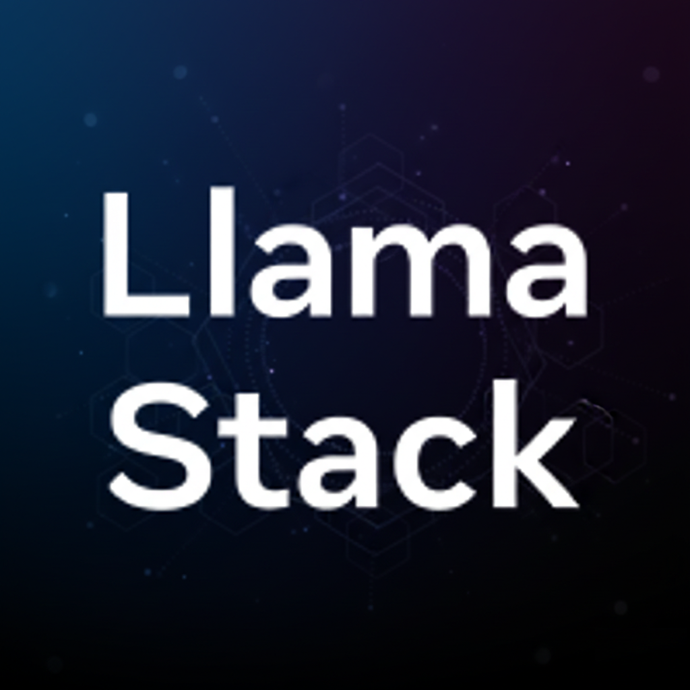

# 🎯 Introduction to MCP Agents

?> **Access Note**: To access the OpenShift console and observe the architecture, authenticate using:
- **Username**: `admin`
- **Password**: `Welcome123`

## What is MCP?

**Model Context Protocol (MCP)** is an open protocol that enables AI assistants to securely access external data sources and tools. MCP servers provide a standardized way for AI applications to interact with various services, databases, and APIs.

For Neuralbank, MCP Agents serve as intelligent intermediaries that:

- **Query Credit Risk Data**: Retrieve customer credit risk information from backend services
- **Update Risk Levels**: Modify credit risk assessments based on loan requests
- **Provide Transparency**: Maintain audit trails for compliance
- **Accelerate Decisions**: Automate manual processes to speed up loan approvals

## LlamaStack Overview

**LlamaStack** is the open-source framework for building generative AI applications. It provides a comprehensive platform for deploying and managing LLMs, tools, agents, and MCP servers.



LlamaStack features:

- **Multiple Model Support**: Chat with various LLM models (Llama, DeepSeek, etc.)
- **RAG Capabilities**: Built-in vector database support for Retrieval Augmented Generation
- **Tools and Agents**: Extensible tool system for custom functionality
- **MCP Integration**: Native support for Model Context Protocol servers
- **Playground Interface**: Interactive UI for testing and development

The Neuralbank MCP Agent integrates with LlamaStack's Playground, allowing commercial agents to interact with the credit risk system through a chat interface.

## The Neuralbank MCP Agent

The MCP Agent you'll build will:

1. **Receive Queries**: Commercial agents query customer credit risk via chat interface
2. **Process Requests**: The MCP Agent processes the query and determines required actions
3. **Interact with Services**: Connects to Neuralbank's credit risk service via Connectivity Link
4. **Update Risk Levels**: Modifies credit risk based on loan request parameters
5. **Return Results**: Provides updated information back to the commercial agent

## Neuralbank Architecture

The Neuralbank topology is already installed in your environment. The complete architecture includes:

- **Frontend Services**: Customer and commercial agent interfaces
- **Authentication Layer**: Keycloak for identity management
- **Backend Services**: Credit risk and loan management services
- **Connectivity Link**: Service mesh for secure communication
- **MCP Agent**: The `customer-service-mcp` service you'll develop


?> **Note**: The complete Neuralbank topology diagram is available in the [Resources section](6-resources/README) under Helm Chart deployment.

## Architecture Flow

```
Commercial Agent (Frontend/Playground)
         │
         │ Chat Query: "Update credit risk for customer X"
         │ (Authenticated via Keycloak)
         ▼
    LlamaStack Playground
         │
         │ MCP Protocol Request
         ▼
    customer-service-mcp (OpenShift)
         │
         │ Query Credit Risk Service via Connectivity Link
         ▼
    Credit Risk Service (Backend)
         │
         │ Update Risk Level
         ▼
    Database
         │
         │ Return Updated Risk
         ▼
    customer-service-mcp
         │
         │ Return Result via MCP
         ▼
    LlamaStack Playground
         │
         │ Display Result
         ▼
Commercial Agent (Frontend)
    "Credit risk updated successfully"
```

## Key Components

### MCP Server
The MCP server runs on OpenShift and implements the Model Context Protocol. It exposes:
- **Tools**: Functions that can query and update credit risk
- **Resources**: Access to credit risk data
- **Prompts**: Pre-configured prompts for common operations

### Integration Points
- **Keycloak**: Authentication and authorization
- **Connectivity Link**: Service-to-service communication
- **Credit Risk Service**: Backend Java service managing risk data
- **Frontend**: Commercial agent chat interface (Playground)

## Benefits for Neuralbank

✅ **Faster Decisions**: Reduce credit approval time from days to minutes  
✅ **Scalability**: Handle increasing loan volumes without proportional staff increases  
✅ **Compliance**: Full audit trail of all operations  
✅ **Transparency**: Clear visibility into risk assessment changes  
✅ **Developer Experience**: Easy to develop, test, and deploy using Golden Path  

## What's Next?

Now that you understand the basics, let's explore the **Golden Path** that the Platform Engineering team has prepared for you. This will make it easy to get started with your development environment.

Click **Golden Path & Developer Hub** to continue.
