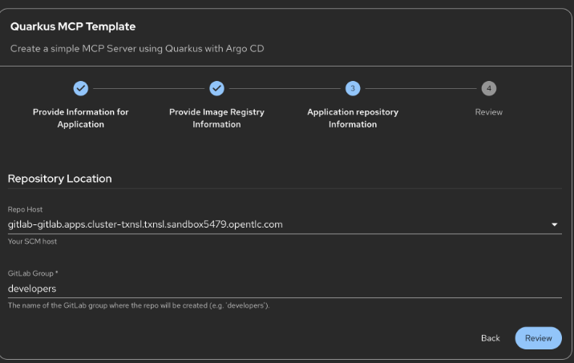

# 🛤️ Golden Path & Developer Hub

## What is the Golden Path?

The **Golden Path** is a curated set of best practices, standards, and tools that the Platform Engineering team has established to improve Developer Experience. It provides:

- **Pre-configured Templates**: Software Templates with everything you need
- **Best Practices**: Industry-standard patterns and conventions
- **Quality Standards**: Built-in testing, security, and compliance checks
- **Quick Start**: Get productive in minutes, not days

For Kevin (and you), the Golden Path means you can:

1. Find a Software Template that matches your needs
2. Generate a complete development environment
3. Start coding immediately with all dependencies configured
4. Deploy with confidence knowing best practices are followed

## Developer Hub

**Red Hat Developer Hub** is a centralized portal where developers can discover and use Software Templates. It integrates with tools like **Cursor** to provide a seamless development experience.

### Accessing Developer Hub

1. Navigate to the Developer Hub:
   <a href="https://developer-hub-developer-hub.apps.<CLUSTER_DOMAIN>" target="_blank">https://developer-hub-developer-hub.apps.<CLUSTER_DOMAIN></a>

2. You'll see a catalog of available Software Templates


## Using the Golden Path Template

The Platform Engineering team has created a specific template for Neuralbank MCP Agents called **Quarkus MCP Server**. This template generates the `customer-service-mcp` service with:

- ✅ Quarkus MCP server skeleton code
- ✅ Java service integration examples
- ✅ Keycloak authentication setup
- ✅ Connectivity Link configuration
- ✅ OpenTelemetry instrumentation
- ✅ DevSpaces workspace configuration
- ✅ Testing framework setup
- ✅ CI/CD pipeline templates

### Step 1: Find the Template

1. **Open Developer Hub**: Navigate to Developer Hub in your browser

2. **Search for Template**: Look for "Quarkus MCP Server" or "customer-service-mcp"


3. **View Template Source** (Optional): You can review the template definition in GitLab:
   - **URL**: <a href="https://gitlab-gitlab.apps.<CLUSTER_DOMAIN>/platform-engineers/developer-hub/-/blob/main/software-templates/quarkus-mcp-template/template.yaml" target="_blank">Template YAML</a>
   - **Access**: Login as `root` / `backstage` to view the template source code

### Step 2: Create from Template

1. **Click on Template**: Select the "Quarkus MCP Server" template

2. **Fill in Parameters**:
   - **Application Name**: `customer-service-mcp`
   - **Project Name**: `neuralbank-mcp`
   - **Git Repository**: Your repository URL (or leave default)
   - **Namespace**: `neuralbank-mcp`
   - **User**: Use `dev1` / `backstage` for the remaining activities


### Step 3: Generate the Project

1. **Click "Create"**: This will generate the project structure

2. **Wait for Generation**: The template will create:
   - Source code structure
   - Configuration files
   - CI/CD pipelines
   - Documentation
   - Test suites





### Step 4: Review Generated Code

1. **Review Configuration**: The template will show you what will be generated


2. **View in Developer Hub**: After generation, you can view the component in Developer Hub

3. **View Code in GitLab**: The generated code is available in GitLab for review and development


The template generates a Quarkus-based MCP server with:

- **MCP Server Implementation**: Ready-to-use MCP protocol implementation
- **Credit Risk Tools**: Skeleton code for query and update operations
- **Integration Layer**: Connectivity Link and Keycloak integration
- **OpenTelemetry**: Pre-configured observability


## What Gets Generated

The Golden Path template generates a structure based on the Quarkus MCP archetype. The generated project follows this structure:

```
customer-service-mcp/
├── src/
│   ├── main/
│   │   ├── java/
│   │   │   └── com/neuralbank/mcp/
│   │   │       ├── CustomerServiceMCPServer.java
│   │   │       ├── tools/
│   │   │       │   ├── QueryCreditRiskTool.java
│   │   │       │   └── UpdateCreditRiskTool.java
│   │   │       └── ...
│   │   └── resources/
│   │       ├── application.properties
│   │       └── mcp-config.yaml
│   └── test/
│       └── java/
│           └── com/neuralbank/mcp/
│               └── ...
├── .devcontainer/
│   └── devcontainer.json
├── .github/
│   └── workflows/
│       └── ci-cd.yml
├── k8s/
│   ├── deployment.yaml
│   └── service.yaml
├── pom.xml
├── README.md
└── .gitignore
```

This structure matches the [Quarkus MCP Template Skeleton](https://github.com/panchoraposo/rh1-demo/tree/main/software-templates/quarkus-mcp-template/skeleton) used by the Platform Engineering team.

## Important: Code is Pre-configured

The generated code includes **commented-out sections** that Kevin needs to uncomment and configure. This is intentional - it allows you to:

1. Understand the code structure
2. Learn by doing
3. Configure for your specific needs

**Kevin's First Task**: After the template generates the code, you'll need to:
1. Uncomment the relevant code sections
2. Review and understand the implementation
3. Commit the changes to start working with Cursor and Playground

## CI/CD Pipeline

The generated project includes a CI/CD pipeline that automates:

- **Build**: Compiles and packages the Quarkus application
- **Test**: Runs unit and integration tests
- **Container Image**: Builds and pushes container images to Quay
- **Deploy**: Deploys to OpenShift using the generated Kubernetes manifests


You can explore the CI/CD configuration in the `.github/workflows/` directory or view it in GitLab's CI/CD section.

## Next Steps

Now that you understand the Golden Path and Developer Hub, let's set up your **DevSpaces workspace** to start developing directly on OpenShift.

Click **Working with DevSpaces** to continue.
