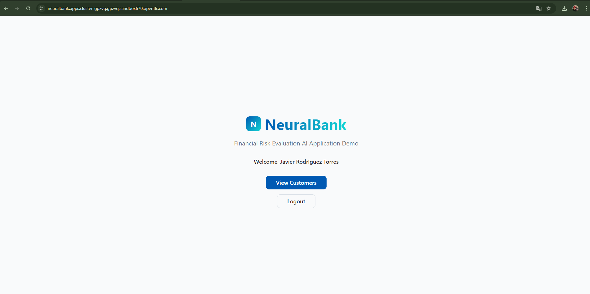

# 🔐 Keycloak User Management

## Overview

Neuralbank uses **Keycloak** for authentication and authorization. As part of the setup, you may need to create users for testing and development purposes.

## Accessing Keycloak

1. **Navigate to Keycloak Console**:
   <a href="https://sso.apps.<CLUSTER_DOMAIN>" target="_blank">https://sso.apps.<CLUSTER_DOMAIN></a>

2. **Login**: Use your admin credentials to access the Keycloak administration console


## Creating a New User

### Step 1: Navigate to Users

1. **Select Realm**: Choose the `neuralbank` realm from the dropdown
2. **Go to Users**: Click on "Users" in the left menu
3. **Add User**: Click the "Add user" button


### Step 2: Configure User Details

1. **Username**: Enter a unique username (e.g., `kevin`, `commercial-agent-1`)
2. **Email**: Enter the user's email address
3. **First Name**: Enter the user's first name
4. **Last Name**: Enter the user's last name
5. **Email Verified**: Toggle if the email is verified
6. **Enabled**: Ensure this is enabled (default)


### Step 2.5: Verify User Login and Access

After creating the user, you can verify that the user can successfully log in and access the Neuralbank services:

1. **Login to Neuralbank**: Navigate to <a href="https://neuralbank.apps.<CLUSTER_DOMAIN>" target="_blank">https://neuralbank.apps.<CLUSTER_DOMAIN></a>
2. **Enter Credentials**: Use the username and password you just created
3. **Verify Access**: Confirm the user can access the customer list and other services




### Step 3: Set Password

1. **Go to Credentials Tab**: Click on the "Credentials" tab
2. **Set Password**: Click "Set password"
3. **Enter Password**: Provide a secure password
4. **Temporary**: Uncheck "Temporary" if you want a permanent password
5. **Save**: Click "Save"

### Step 4: Assign Roles (Optional)

1. **Go to Role Mappings**: Click on "Role Mappings" tab
2. **Assign Groups**: Add the user to appropriate groups:
   - `US-Clients` - For US-based clients
   - `LATAM-Clients` - For Latin America clients
   - `EU-Clients` - For European clients
3. **Assign Realm Roles**: Add appropriate realm roles:
   - `personal-client` - For individual clients
   - `corporate-client` - For corporate clients
4. **Assign Client Roles**: If needed, assign client-specific roles

## Login Flow

When users access Neuralbank services, they go through the following authentication flow:


### Step 1: Access Service

User attempts to access a protected Neuralbank service:
- **Neuralbank Web Site**: <a href="https://neuralbank.apps.<CLUSTER_DOMAIN>" target="_blank">https://neuralbank.apps.<CLUSTER_DOMAIN></a>
- **Playground**: LlamaStack Playground interface
- **Frontend**: Customer and commercial agent interfaces

### Step 2: Redirect to Keycloak

The service redirects the user to Keycloak for authentication


### Step 3: User Authentication

User enters credentials:
- **Username**: The username created in Keycloak
- **Password**: The password set for the user

### Step 4: Token Issuance

Upon successful authentication, Keycloak issues:
- **Access Token**: Used for API calls
- **Refresh Token**: Used to obtain new access tokens
- **ID Token**: Contains user identity information

### Step 5: Service Access

The user is redirected back to the service with the tokens, allowing access to protected resources

## Testing Authentication

You can test the authentication flow by:

1. **Accessing Playground**: Navigate to the LlamaStack Playground
2. **Login Prompt**: You'll be redirected to Keycloak
3. **Enter Credentials**: Use the user credentials you created
4. **Access Granted**: Once authenticated, you can use the Playground

## Obtaining Bearer Token for API Calls

To make API calls to Neuralbank services programmatically, you need to obtain a bearer token from Keycloak. This token can be used in `curl` commands or any HTTP client to authenticate requests.

### Step 1: Get Access Token from Keycloak

Use the following `curl` command to obtain an access token using a Neuralbank user's credentials:

```bash
# Replace <USERNAME> and <PASSWORD> with your Neuralbank user credentials
# Replace <CLUSTER_DOMAIN> with your cluster domain

curl -X POST https://sso.apps.<CLUSTER_DOMAIN>/realms/neuralbank/protocol/openid-connect/token \
  -H "Content-Type: application/x-www-form-urlencoded" \
  -d "grant_type=password" \
  -d "client_id=neuralbank" \
  -d "username=<USERNAME>" \
  -d "password=<PASSWORD>"
```

**Example with actual values**:
```bash
curl -X POST https://sso.apps.ocp.ccld9.sandbox1286.opentlc.com/realms/neuralbank/protocol/openid-connect/token \
  -H "Content-Type: application/x-www-form-urlencoded" \
  -d "grant_type=password" \
  -d "client_id=neuralbank" \
  -d "username=robert.anderson@email.com" \
  -d "password=Welcome123"
```

### Step 2: Extract the Access Token

The response will be a JSON object containing the access token:

```json
{
  "access_token": "eyJhbGciOiJSUzI1NiIsInR5cCIgOiAiSldUIiwia2lkIiA6ICJ...",
  "expires_in": 300,
  "refresh_expires_in": 1800,
  "refresh_token": "eyJhbGciOiJIUzI1NiIsInR5cCIgOiAiSldUIiwia2lkIiA6ICJ...",
  "token_type": "Bearer",
  "not-before-policy": 0,
  "session_state": "abc123-def456-ghi789",
  "scope": "profile email"
}
```

**Extract the token** (using `jq` if available):
```bash
# Save the response to a variable
TOKEN_RESPONSE=$(curl -s -X POST https://sso.apps.<CLUSTER_DOMAIN>/realms/neuralbank/protocol/openid-connect/token \
  -H "Content-Type: application/x-www-form-urlencoded" \
  -d "grant_type=password" \
  -d "client_id=neuralbank" \
  -d "username=robert.anderson@email.com" \
  -d "password=Welcome123")

# Extract access token
ACCESS_TOKEN=$(echo $TOKEN_RESPONSE | jq -r '.access_token')

# Display the token (for verification)
echo $ACCESS_TOKEN
```

**Or extract manually** (without `jq`):
```bash
# Get token and extract using grep/sed
ACCESS_TOKEN=$(curl -s -X POST https://sso.apps.<CLUSTER_DOMAIN>/realms/neuralbank/protocol/openid-connect/token \
  -H "Content-Type: application/x-www-form-urlencoded" \
  -d "grant_type=password" \
  -d "client_id=neuralbank" \
  -d "username=robert.anderson@email.com" \
  -d "password=Welcome123" | grep -o '"access_token":"[^"]*' | sed 's/"access_token":"//')
```

### Step 3: Use Token to Call Backend Services

Once you have the access token, you can use it to make authenticated API calls to Neuralbank backend services:

#### Example 1: Query Customer Information

```bash
# Call the customer service to get customer information
curl -X GET https://neuralbank.apps.<CLUSTER_DOMAIN>/api/customers/1 \
  -H "Authorization: Bearer $ACCESS_TOKEN" \
  -H "Content-Type: application/json"
```

#### Example 2: Query Credit Risk

```bash
# Query credit risk for a customer
curl -X GET https://neuralbank.apps.<CLUSTER_DOMAIN>/api/credit-risk/query?customerId=CUST-12345 \
  -H "Authorization: Bearer $ACCESS_TOKEN" \
  -H "Content-Type: application/json"
```

#### Example 3: Update Credit Risk (via MCP Service)

```bash
# Call the MCP service endpoint to update credit risk
curl -X POST https://neuralbank.apps.<CLUSTER_DOMAIN>/api/credit-risk/update \
  -H "Authorization: Bearer $ACCESS_TOKEN" \
  -H "Content-Type: application/json" \
  -d '{
    "customerId": "CUST-12345",
    "loanAmount": 50000,
    "loanPurpose": "HOME_IMPROVEMENT"
  }'
```

#### Example 4: Complete Workflow Script

Here's a complete example that gets a token and makes a call:

```bash
#!/bin/bash

# Configuration
CLUSTER_DOMAIN="ocp.ccld9.sandbox1286.opentlc.com"
USERNAME="robert.anderson@email.com"
PASSWORD="Welcome123"
KEYCLOAK_URL="https://sso.apps.${CLUSTER_DOMAIN}/realms/neuralbank/protocol/openid-connect/token"
API_URL="https://neuralbank.apps.${CLUSTER_DOMAIN}/api"

# Step 1: Get access token
echo "Obtaining access token..."
TOKEN_RESPONSE=$(curl -s -X POST "${KEYCLOAK_URL}" \
  -H "Content-Type: application/x-www-form-urlencoded" \
  -d "grant_type=password" \
  -d "client_id=neuralbank" \
  -d "username=${USERNAME}" \
  -d "password=${PASSWORD}")

# Step 2: Extract token
ACCESS_TOKEN=$(echo $TOKEN_RESPONSE | jq -r '.access_token')

if [ -z "$ACCESS_TOKEN" ] || [ "$ACCESS_TOKEN" == "null" ]; then
  echo "Error: Failed to obtain access token"
  echo "Response: $TOKEN_RESPONSE"
  exit 1
fi

echo "Token obtained successfully!"
echo "Token (first 50 chars): ${ACCESS_TOKEN:0:50}..."

# Step 3: Make API call
echo ""
echo "Calling backend API..."
curl -X GET "${API_URL}/customers/1" \
  -H "Authorization: Bearer $ACCESS_TOKEN" \
  -H "Content-Type: application/json" \
  -v

echo ""
echo "API call completed!"
```

### Token Expiration

Access tokens typically expire after **5 minutes** (300 seconds). If your token expires:

1. **Get a new token**: Repeat Step 1 to obtain a fresh token
2. **Use refresh token**: Use the `refresh_token` from the initial response to get a new access token without re-entering credentials:

```bash
# Refresh the access token
curl -X POST https://sso.apps.<CLUSTER_DOMAIN>/realms/neuralbank/protocol/openid-connect/token \
  -H "Content-Type: application/x-www-form-urlencoded" \
  -d "grant_type=refresh_token" \
  -d "client_id=neuralbank" \
  -d "refresh_token=<REFRESH_TOKEN_FROM_PREVIOUS_RESPONSE>"
```

### Security Best Practices

- **Never commit tokens**: Don't store tokens in version control
- **Use environment variables**: Store tokens in environment variables, not in scripts
- **Token expiration**: Always handle token expiration in your applications
- **HTTPS only**: Always use HTTPS when transmitting tokens
- **Rotate credentials**: Regularly update user passwords

## User Roles and Groups

The Neuralbank realm includes the following groups and realm roles:

### Groups

- **US-Clients**: Clients from the United States
- **LATAM-Clients**: Clients from Latin America
- **EU-Clients**: Clients from Europe

### Realm Roles

- **personal-client**: For individual/personal clients
- **corporate-client**: For corporate/business clients

### Additional Roles

- **commercial-agent**: Can query and update credit risk
- **developer**: Can develop and test MCP agents
- **admin**: Full administrative access
- **viewer**: Read-only access to credit risk data

## Next Steps

Now that you understand user management in Keycloak, let's explore **Connectivity Link** to understand how services communicate securely in Neuralbank.

Click **Connectivity Link** to continue, or proceed to **Build MCP Agent** if you're ready to start coding.

