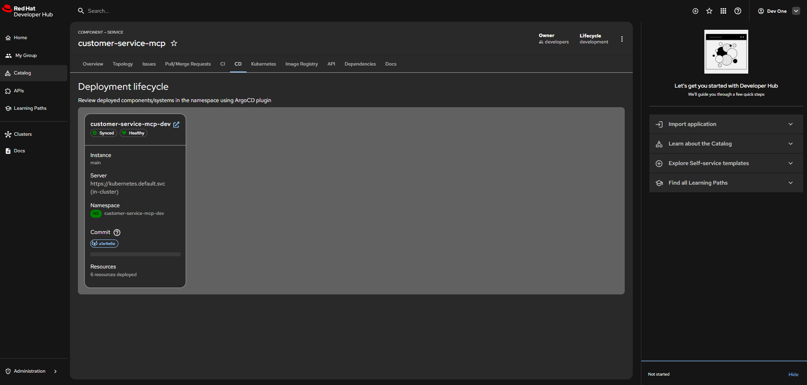

# 🤖 Deploy & Integrate

Now that your `customer-service-mcp` is built and tested in DevSpaces, let's integrate it with Playground (via OpenShift AI) so commercial agents can use it.

## Development Approach

**Important**: The `customer-service-mcp` service is **not deployed using `oc` commands**. Instead:

- **Developed in DevSpaces**: All development happens in your DevSpaces workspace
- **Tested Locally**: Use Quarkus dev mode for local testing
- **Integrated via Git**: Committed code is automatically available to Playground
- **Runtime in OpenShift**: The service runs automatically when accessed via Playground

## Integration with Playground

The `customer-service-mcp` integrates with Playground (via OpenShift AI), allowing commercial agents to interact with the credit risk system through a chat interface.

### Step 1: Verify Service is Committed

Ensure your uncommented code is committed:

```bash
# Check git status
git status

# If there are uncommitted changes, commit them
git add .
git commit -m "Uncomment and configure MCP tools"
git push
```

### Step 2: Access Playground via OpenShift AI

1. **Navigate to OpenShift AI Console**:
   <a href="https://console-openshift-console.apps.<CLUSTER_DOMAIN>" target="_blank">https://console-openshift-console.apps.<CLUSTER_DOMAIN></a>
   - Login with `admin` / `Welcome123`

2. **Access Playground**:
   - Navigate to **OpenShift AI** → **Playground**
   - Or directly access: <a href="https://llama-stack-playground-llama-stack.apps.<CLUSTER_DOMAIN>" target="_blank">https://llama-stack-playground-llama-stack.apps.<CLUSTER_DOMAIN></a>

3. **Login**: Authenticate via Keycloak (see [Keycloak User Management](2.5-keycloak-user-management.md))


#### Before MCP Integration: Loan Rejected Scenario

Before integrating the MCP service, loan requests cannot be automatically processed. When a commercial agent tries to process a loan, the system cannot access the credit risk information, resulting in loan rejection:


**Scenario**: A commercial agent attempts to process a loan for a customer, but without the MCP integration, the system cannot query or update credit risk information, leading to automatic rejection of the loan application.

### Step 3: Configure MCP Server

1. **Open MCP Settings**: In Playground, navigate to MCP server configuration
2. **Configure customer-service-mcp**: 
   - **Name**: `customer-service-mcp`
   - **Endpoint**: `http://customer-service-mcp.neuralbank.apps.<CLUSTER_DOMAIN>/mcp/sse`
   - **Protocol**: HTTP (SSE - Server-Sent Events)
   - **Port**: 8081
3. **Verify Connection**: Ensure the service is connected and tools are available

?> **Note**: Use the external route URL (`http://customer-service-mcp.neuralbank.apps.<CLUSTER_DOMAIN>/mcp/sse`) for access from Playground. The internal `svc.cluster.local` URL is only accessible from within the cluster.


### Step 4: Test Query Tool

Test the `query_credit_risk` tool:

1. **Open Chat**: Start a new chat session in Playground
2. **Query Credit Risk**: Type:
   ```
   "What is the credit risk for customer CUST-12345?"
   ```
3. **Review Response**: The MCP agent should return credit risk information

### Step 5: Test Update Tool

Test the `update_credit_risk` tool:

1. **Update Request**: Type:
   ```
   "Update credit risk for customer CUST-12345 with a $50,000 home improvement loan"
   ```
2. **Review Response**: Should show updated risk level


### Step 6: Verify Risk Update

After updating the risk:

1. **Query Again**: Ask for the same customer's risk
2. **Confirm Change**: The risk level should reflect the update
3. **Check Audit Trail**: Verify the update is logged in OpenTelemetry

#### After MCP Integration: Loan Approved Scenario

After integrating the MCP service and invoking the risk update from Playground, the system can now automatically process loan requests. When a commercial agent processes a loan, the MCP service queries and updates the credit risk information, allowing for intelligent loan approval:


**Scenario**: A commercial agent processes a loan request for a customer through Playground. The MCP service:
1. Queries the current credit risk for the customer
2. Updates the risk level based on the loan details (amount, purpose, etc.)
3. Returns the updated risk assessment
4. The system approves the loan based on the improved risk profile

This demonstrates the power of MCP integration: real-time credit risk management that enables faster, more accurate loan decisions.

## End-to-End Flow

Here's the complete flow:

```
1. Commercial Agent (Playground)
   │
   │ "Update credit risk for CUST-12345"
   │ (Authenticated via Keycloak)
   │
   ▼
2. Playground (OpenShift AI)
   │
   │ MCP Protocol Request
   │
   ▼
3. customer-service-mcp (DevSpaces/OpenShift)
   │
   │ Authenticate via Keycloak
   │ Call Credit Risk Service via Connectivity Link
   │
   ▼
4. Credit Risk Service (Backend)
   │
   │ Update Database
   │
   ▼
5. customer-service-mcp
   │
   │ Return Updated Risk via MCP
   │
   ▼
6. Playground (OpenShift AI)
   │
   │ Display Result
   │
   ▼
7. Commercial Agent
   "Credit risk updated from MEDIUM to LOW"
```

## Testing from Playground

### Using Cursor in Playground

You can also use Cursor to interact with the MCP agent:


1. **Open Cursor**: In your DevSpaces workspace or locally
2. **Configure MCP**: Point Cursor to your `customer-service-mcp` service
   - **Endpoint**: `http://customer-service-mcp.neuralbank.apps.<CLUSTER_DOMAIN>/mcp/sse`
   - **Protocol**: HTTP (SSE)
   - **Port**: 8081
3. **Test Queries**: Ask Cursor to use MCP tools

?> **Note**: When configuring Cursor from DevSpaces (inside the cluster), you can use either the internal service URL (`http://customer-service-mcp.neuralbank.svc.cluster.local:8081/mcp/sse`) or the external route. For local Cursor installations, use the external route URL.


### Example Cursor Queries

**Query Credit Risk**:
```
"Use the customer-service-mcp to query credit risk for customer CUST-12345"
```

**Update Credit Risk**:
```
"Update credit risk for customer CUST-12345 with a $50,000 home improvement loan using customer-service-mcp"
```

## CI/CD Pipeline

The generated project includes a CI/CD pipeline that automates the deployment of the MCP service. The pipeline uses **OpenShift Pipelines** (Tekton) for:

- **Build**: Compiles and packages the Quarkus application
- **Test**: Runs unit and integration tests
- **Container Image**: Builds and pushes container images to Quay
- **Deploy**: Deploys to OpenShift using the generated Kubernetes manifests


**OpenShift Pipelines** provides a cloud-native CI/CD solution that runs directly on your OpenShift cluster. The pipeline is defined in Tekton format and can be viewed in:
- GitLab CI/CD section
- OpenShift Console → Pipelines
- The generated pipeline definitions in the project

You can explore the CI/CD configuration in the project repository or view it in GitLab's CI/CD section.

## GitOps with ArgoCD

The `customer-service-mcp` service can also be deployed using **GitOps** principles with **ArgoCD**. This provides declarative infrastructure management and automated synchronization.



### Viewing GitOps Configuration

To view the GitOps configuration for the MCP service:

- **ArgoCD Console**: Navigate to ArgoCD in your cluster to see the application
- **Git Repository**: View the GitOps manifests in the repository
- **Application Status**: Monitor deployment status and sync state in ArgoCD

?> **Note**: The GitOps configuration for the MCP service is available in the repository. You can explore it to understand how the service is managed declaratively.

## Monitoring Integration

### View in OpenShift Topology

1. **OpenShift Console**: Navigate to `neuralbank` project (Neuralbank project)
2. **Topology View**: See `customer-service-mcp` in the topology
3. **Service Connections**: View how it connects to other services

### View in OpenTelemetry

See [OpenTelemetry Observability](6-opentelemetry.md) for details on viewing traces and logs.

## Troubleshooting

### Service Not Available in Playground

- **Check Git Commit**: Ensure code is committed and pushed
- **Verify Service Running**: Check if service is running in DevSpaces
- **Check MCP Configuration**: Verify MCP server configuration

### Authentication Issues

- **Keycloak Login**: Ensure you're logged in via Keycloak
- **Token Validity**: Check if tokens are expired
- **User Permissions**: Verify user has required roles

### Connectivity Link Issues

- **Service Discovery**: Check if services are discoverable
- **Network Policies**: Verify network policies allow communication
- **Rate Limits**: Check if rate limits are being hit

## 🎉 Congratulations!

You've successfully deployed and integrated your MCP Agent! You've learned how to:

- <input type="checkbox" id="deploy1" checked> <label for="deploy1">Configure MCP server in LlamaStack Playground</label>
- <input type="checkbox" id="deploy2" checked> <label for="deploy2">Test loan approval scenarios (rejected → approved)</label>
- <input type="checkbox" id="deploy3" checked> <label for="deploy3">Integrate with Cursor for AI-assisted development</label>
- <input type="checkbox" id="deploy4" checked> <label for="deploy4">Understand CI/CD pipeline with OpenShift Pipelines</label>
- <input type="checkbox" id="deploy5" checked> <label for="deploy5">Explore GitOps deployment with ArgoCD</label>

Your MCP Agent is now live and helping commercial agents make faster credit decisions! The integration with Playground allows agents to update credit risk levels in real-time, transforming loan approval workflows.

## Next Steps

Excellent! Your `customer-service-mcp` is integrated with Playground. Now let's set up **OpenTelemetry** to monitor distributed traces and ensure everything is working correctly.

Click **OpenTelemetry Observability** to continue.
